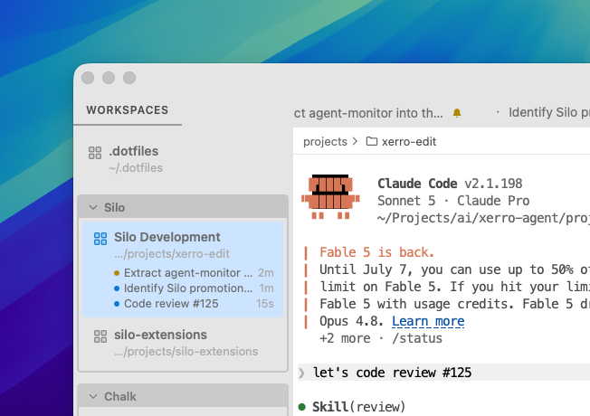

# Agent Monitor

A [Silo](https://github.com/silo-code/silo) extension that keeps track of every coding agent running in your terminals — so you always know which ones are working, which finished, and which are waiting on you — without tabbing through every terminal to check.



## What you get

- **Status rows in the Workspaces panel** — each terminal running an agent gets a row while it's busy (with elapsed time) or once it finishes and needs your attention
- **Terminal tab badges** — a spinner, warning, or checkmark decorates the tab itself, so status is visible even with the panel closed
- **Sticky "needs attention"** — a finished/errored agent stays flagged until you actually view that terminal, so nothing gets missed in a stack of background sessions
- **Survives restarts** — per-terminal state (and elapsed time) is persisted, and a restored row is marked "(unconfirmed)" if the gap since last seen is long enough that the agent may have finished without being observed
- **Configurable** — a Settings page toggle to suppress status for whichever terminal is currently focused, instead of always showing it

## Supported agents

Detection is driven entirely by terminal escape sequences (OSC), so there's nothing to configure per-agent:

| Agent | Signal |
| --- | --- |
| **Claude Code** | OSC 0 title: braille spinner (busy) / `✳` (waiting) |
| **Cursor Agent** | OSC 0 title when `display.showStatusIndicators` is enabled in `~/.cursor/cli-config.json` (`⏳ Working …` / `✅ Ready`, etc.); otherwise falls back to detecting the TUI's braille spinner frames in the raw PTY stream |
| **Codex CLI** | OSC 0 braille spinner (busy, shared with Claude); idle via plain project title after the spinner clears, empty title / `[ ! ]` / `[ . ]` when blocked or exited, plus OSC 9 desktop notifications when available |
| **GitHub Copilot CLI** | OSC 9;4 progress protocol |
| **Anything with shell integration** (e.g. `pi`) | OSC 133 FTCS sequences — command-running vs. prompt-returned, with an idle-debounce fallback for agents that never emit a completion signal |

A plain shell only gets a row once one of the agent-specific signals fires in it (e.g. typing `claude` into an ordinary terminal); it's demoted back to a plain shell once the agent process exits.

## Permissions

None — the extension only reads terminal OSC output and workspace/terminal state, all exposed through the SDK without any capability grant.

## Installing

### From a GitHub Release

1. Go to [Releases](https://github.com/silo-code/silo-extensions/releases?q=agent-monitor).
2. Right-click the `.tgz` asset → **Copy link address**.
3. In Silo: **Settings → Extensions**, paste the URL and click **Install**.

### From source

```sh
git clone https://github.com/silo-code/silo-extensions
cd silo-extensions/agent-monitor
npm install
npm run build
```

Then in Silo: **Settings → Extensions → Install from folder**, point at this directory.

## Building

```sh
npm install
npm run build        # one-shot
npm run build:watch  # watch mode
npm test             # unit tests
```
