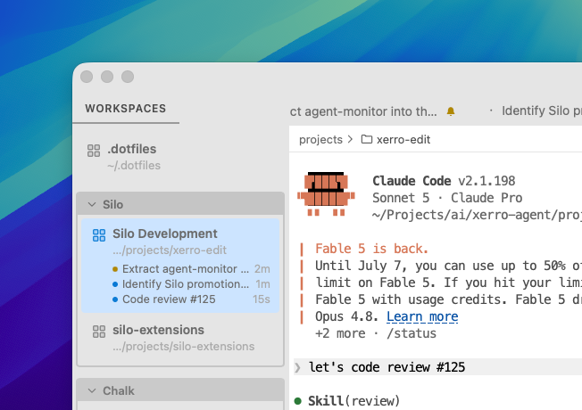

# Agent Monitor

A [Silo](https://github.com/silo-code/silo) extension that keeps track of every coding agent running in your terminals — so you always know which ones are working, which finished, and which are waiting on you — without tabbing through every terminal to check.



## What you get

- **Status rows in the Workspaces panel** — each terminal running an agent gets a row while it's busy (with elapsed time), once it finishes and needs your attention, or if it errors out
- **Terminal tab badges** — a spinner, check, warning, or error glyph decorates the tab itself, so status is visible even with the panel closed
- **Sticky "needs attention"** — a finished agent stays flagged until you actually view that terminal, so nothing gets missed in a stack of background sessions
- **Survives restarts** — state and elapsed time are restored across app restarts, and a restored row is marked "(unconfirmed)" if the gap since last seen is long enough that the agent may have finished without being observed
- **Dead-session recovery** — if a terminal's agent backend is confirmed gone after an unclean shutdown, its tab shows a warning and (when Silo could resolve one) a copy-pasteable `--resume` hint right in the tooltip
- **Sound** — an optional chime whenever an agent stops working, whether or not you're watching its terminal
- **Configurable** — a Settings page to choose what viewing a finished terminal does (acknowledge, acknowledge + hide its row, or leave it), plus the notification sound

## Supported agents

Since Silo **0.39**, agent detection is done by the host and exposed to extensions through the `ctx.agents` API — this extension is a thin view over that shared state, so there's nothing to detect or configure per-agent here. Silo recognizes Claude Code, Cursor Agent, Codex CLI, GitHub Copilot CLI, and anything with terminal shell integration (e.g. `pi`), including agents typed into a plain shell. See Silo's own **Settings → Agents** page for the authoritative list and detection details.

## Requirements

Silo **0.39.0 or newer** (for the `ctx.agents` API).

## Permissions

None — the extension only reads host-computed agent state and workspace/terminal titles, all exposed through the SDK without any capability grant.

## Installing

### From a GitHub Release

1. Go to [Releases](https://github.com/silo-code/silo-extensions/releases?q=agent-monitor).
2. Right-click the `.tgz` asset → **Copy link address**.
3. In Silo: **Settings → Extensions**, paste the URL and click **Install**.

### From source

```sh
git clone https://github.com/silo-code/silo-extensions
cd silo-extensions/agent-monitor
npm install
npm run build
```

Then in Silo: **Settings → Extensions → Install from folder**, point at this directory.

## Building

```sh
npm install
npm run build        # one-shot
npm run build:watch  # watch mode
npm test             # unit tests
```
