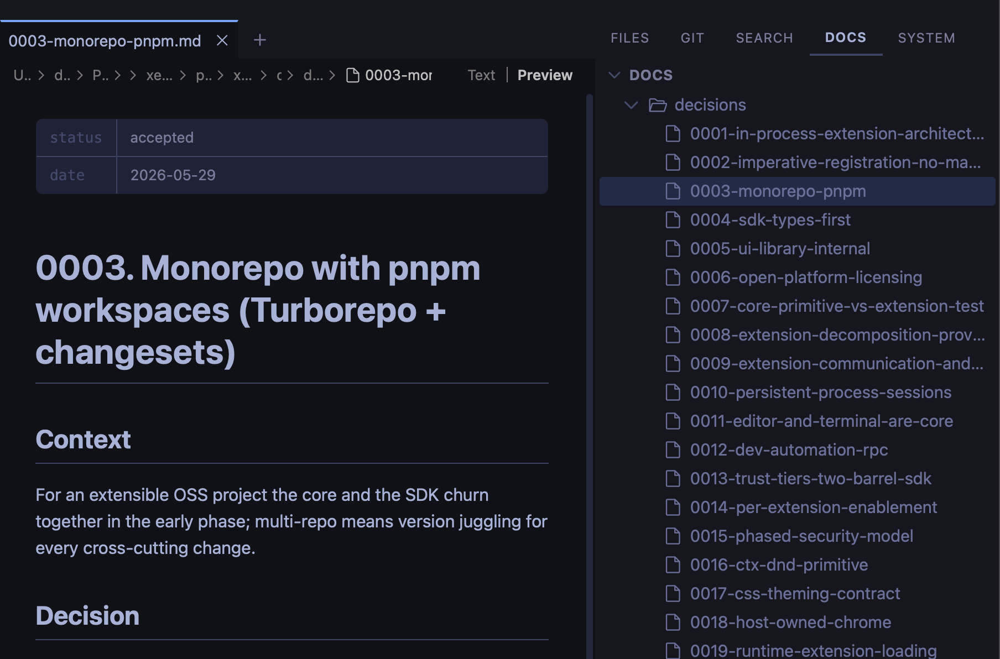

# Documents Side Panel

A [Silo](https://github.com/silo-code/silo) extension that adds a dedicated side panel for browsing and reading markdown documentation — rendered, not raw.



## What you get

- **Markdown-only tree** — the DOCS panel shows only `.md` and `.mdx` files, keeping docs separate from source code
- **Rendered preview on click** — files open directly in preview mode, no extra steps
- **Multiple folder roots** — add folders from anywhere on disk, not just inside the workspace
- **Per-workspace state** — configured roots and tree collapse state are stored per workspace and swap automatically when you switch
- **Live file watching** — the tree updates automatically when files are added, removed, or renamed

## Installing

### From a GitHub Release

1. Go to [Releases](https://github.com/silo-code/silo-extensions/releases?q=docs-panel).
2. Right-click the `.tgz` asset → **Copy link address**.
3. In Silo: **Settings → Extensions**, paste the URL and click **Install**.

### From source

```sh
git clone https://github.com/silo-code/silo-extensions
cd silo-extensions/docs-panel
npm install
npm run build
```

Then in Silo: **Settings → Extensions → Install from folder**, point at this directory.

## Usage

The **Docs** panel appears in the right-side panel strip alongside GIT, SEARCH, and SYSTEM.

- **Add a folder root** — hover over any root section header and click **+** to open the native folder picker
- **Navigate** — click files to open them in preview; use **↑ / ↓** to move between rows and **← / →** to collapse or expand folders
- **Remove a root** — hover the root header and click **×** (only affects the current workspace)

## Building

```sh
npm install
npm run build        # one-shot
npm run build:watch  # watch mode
```
