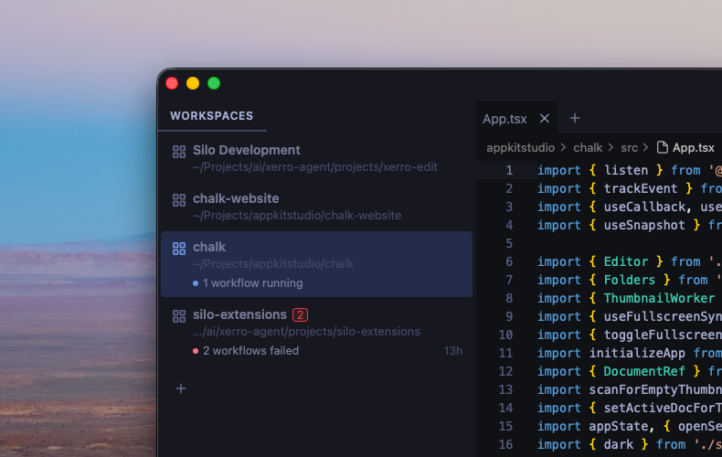
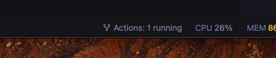
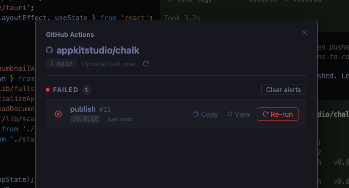

# GitHub Actions

A [Silo](https://github.com/silo-code/silo) extension that surfaces GitHub Actions workflow status directly in your editor — across every open workspace, without leaving your code.



## What you get

- **Status bar item** — live count of failing and running workflows for the active workspace, always visible at the bottom of the window
- **Workspace badges and decorations** — failure counts and status labels appear next to each workspace in the sidebar so you can spot problems at a glance
- **Workflow modal** — click the status bar item to open a full list of failing and running runs, with one-click re-run of a workflow and links to GitHub
- **Failure notifications** — desktop alerts when a new failure is detected in any open workspace
- **Per-workspace branch filter** — optionally restrict monitoring to only the checked-out branch for each workspace independently
- **Configurable polling** — separate intervals for the active workspace and background workspaces

## Screenshots

**Status bar**



**Workflow modal**



## Requirements

This extension uses the [`gh` CLI](https://cli.github.com) to authenticate and fetch workflow data. Install it and run `gh auth login` before installing the extension.

## Installing

### From a GitHub Release

1. Go to [Releases](https://github.com/silo-code/silo-extensions/releases?q=github-actions).
2. Right-click the `.tgz` asset → **Copy link address**.
3. In Silo: **Settings → Extensions**, paste the URL and click **Install**.

### From source

```sh
git clone https://github.com/silo-code/silo-extensions
cd silo-extensions/github-actions
npm install
npm run build
```

Then in Silo: **Settings → Extensions → Install from folder**, point at this directory.

## Usage

Once installed and authenticated, the extension starts polling automatically. A status bar item appears at the bottom right showing the state of the active workspace's repo:

| Label | Meaning |
|---|---|
| `Actions: ok` | All workflows passing |
| `Actions: 2 failed` | Two distinct workflows have recent failures |
| `Actions: 3 running` | Three runs in progress |
| `Actions: Auth failed` | `gh auth login` required |
| `Actions: cli missing` | `gh` CLI not installed |

Click the status bar item to open the workflow modal for the active workspace. From there you can refresh, re-run failed jobs, copy run URLs, and open runs on GitHub.

### Branch filter

Each workspace has its own **Only monitor the checked-out branch** toggle at the bottom of the modal. When enabled, only runs on the branch currently checked out in that workspace's folder are shown — runs on other branches are filtered out. The setting persists per workspace across restarts. Other workspaces are unaffected.

## Settings

Open **Settings → GitHub Actions** to configure:

| Setting | Default | Description |
|---|---|---|
| Active workspace interval | 1 minute | How often to poll the active workspace |
| Inactive workspace interval | 10 minutes | How often to poll background workspaces |

## Permissions

Declared in `package.json` under `silo.permissions`:

- **`process`** — run `gh api` to fetch workflow runs (and trigger re-runs) and `gh auth status` to check authentication

## Building

```sh
npm install
npm run build        # one-shot
npm run build:watch  # watch mode
```
