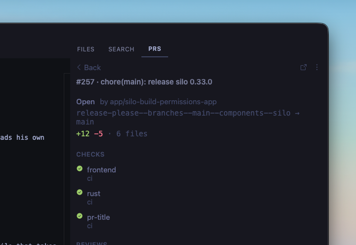

# GitHub Pull Requests

A [Silo](https://github.com/silo-code/silo) extension that shows pull requests for the repos in your workspace in a right side panel — review state, CI checks, and drill-in details without leaving the editor.



## What you get

- **Side panel** — open PRs for every GitHub remote in the active workspace
- **Filters** — My PRs (default), Needs my review, All open, Recently merged (per workspace)
- **In-panel navigation** — click a row for CI checks, reviews, description, and activity; back / Escape returns to the list
- **At-a-glance status** — review icons, check rollup, draft and conflict chips
- **Copy actions** — PR URL, head branch name, `gh pr checkout N`
- **Polling** — configurable intervals for active and background workspaces

## Requirements

This extension uses the [`gh` CLI](https://cli.github.com). Install it and run `gh auth login` before using the extension.

## Installing

### From a GitHub Release

1. Go to [Releases](https://github.com/silo-code/silo-extensions/releases?q=github-prs).
2. Right-click the `.tgz` asset → **Copy link address**.
3. In Silo: **Settings → Extensions**, paste the URL and click **Install**.

### From source

```sh
git clone https://github.com/silo-code/silo-extensions
cd silo-extensions/github-prs
npm install
npm run build
```

Then in Silo: **Settings → Extensions → Install from folder**, point at this directory.

## Usage

Once installed and authenticated, open the **PRS** panel on the right. The default filter is **My PRs**. Switch filters from the header menu; **Recently merged** fetches on demand.

Click a row for details. The detail view uses list data immediately, then hydrates the description and timeline. Use the overflow menu to copy the URL, branch name, or checkout command.

## Settings

Open **Settings → GitHub Pull Requests**:

| Setting | Default | Description |
|---|---|---|
| Active workspace interval | 1 minute | How often to poll the active workspace |
| Inactive workspace interval | 10 minutes | How often to poll background workspaces |

## Permissions

Declared in `package.json` under `silo.permissions`:

- **`process`** — run `gh` / `git` to resolve remotes, list PRs, and check authentication
