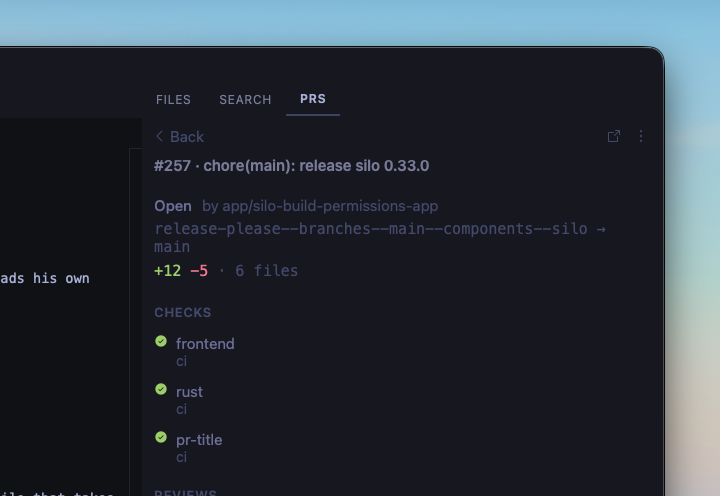

# GitHub Pull Requests

Browse open and recently merged pull requests for the GitHub repos in your workspace — review state, CI checks, and drill-in details — without leaving Silo.



## What you get

- Side panel listing PRs for every unique GitHub remote in the active workspace (worktrees of the same repo collapse into one list)
- Filters: My PRs (default), Needs my review, All open, Recently merged
- Click a row for CI checks, reviews, description, and activity
- Drill from a PR into its commits, then a commit's changed files, then open a file's diff — sourced from GitHub directly, so it works even for commits never fetched into your local clone (e.g. a fork PR's head)
- Or drill straight into every file the PR changes overall (diffed against its merge-base, matching GitHub's own "Files changed" tab) without stepping through individual commits
- Every review is listed, not just each reviewer's latest — a reviewer can leave several (e.g. commented, then had it auto-dismissed by a later push), and each one is its own clickable row. Click through to read the full write-up on its own page, not just the state icon, including inline (file/line) comments, which often carry the actual feedback when the review's own summary is empty
- Descriptions and review bodies render embedded raw HTML too (common in bot-generated reviews, e.g. Cursor Bugbot's `<picture>`/`<details>` output), sanitized so untrusted PR content can never execute script or inject an unsafe link
- Merge from the detail view when the PR is merge-ready (disabled with a reason otherwise)
- At-a-glance review icons, check rollup, draft and conflict chips
- Copy PR URL, head branch, or `gh pr checkout N`
- Configurable polling for active and background workspaces

## Requirements

Install the [`gh` CLI](https://cli.github.com) and run `gh auth login`.

## Installing

### From a GitHub Release

1. Go to [Releases](https://github.com/silo-code/silo-extensions/releases?q=github-prs).
2. Right-click the `.tgz` asset → **Copy link address**.
3. In Silo: **Settings → Extensions**, paste the URL and click **Install**.

### From source

```sh
git clone https://github.com/silo-code/silo-extensions
cd silo-extensions/github-prs
npm install
npm run build
```

Then in Silo: **Settings → Extensions → Install from folder**, point at this directory.

## Usage

Open the **PRS** panel on the right. The default filter is **My PRs**. Switch filters from the header menu; **Recently merged** fetches on demand.

Click a row for details. List data shows immediately; description and activity load next. Use **Merge** on the detail header when the PR is ready (confirm first). Use the overflow menu to copy the URL, branch name, or checkout command.

From the detail view, open **Commits** to see the PR's own commit history, click a commit for its changed files, then click a file to open its diff. Or open **Files changed** to go straight to every file the PR touches overall. Click a review under **Reviews** to read its full body.

If monitoring was turned off for a workspace, use **Enable** in the panel gate to turn it back on.

## Settings

Open **Settings → GitHub Pull Requests**:

| Setting | Default | Description |
|---|---|---|
| Active workspace interval | 1 minute | How often to poll the active workspace |
| Inactive workspace interval | 10 minutes | How often to poll background workspaces |

## Permissions

None declared — every `gh` invocation runs scoped to an open workspace folder, which doesn't require the `process` permission.

## Building

```sh
npm install
npm run build        # one-shot
npm run build:watch  # watch mode
```
