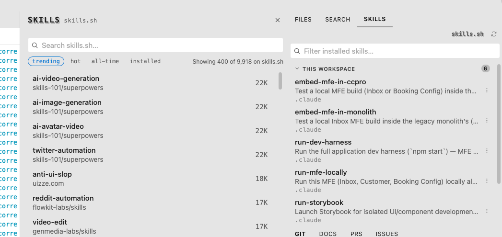
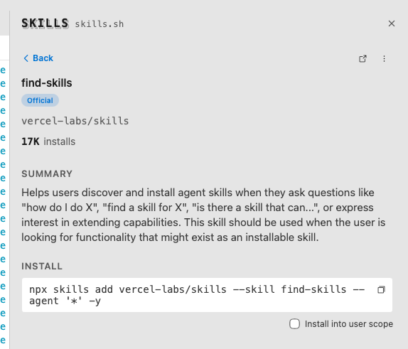

# Skills Manager

A [Silo](https://github.com/silo-code/silo) extension for [Agent Skills](https://agentskills.io) — see what's installed in the current workspace at a glance, then search, install, and remove more from [skills.sh](https://skills.sh) without ever leaving the editor.



## What you get

- **A Skills panel** — every skill installed in the current workspace and your user scope, grouped and filterable, so you always know what's already available to your agents without digging through `.claude/skills` folders by hand
- **Browse skills.sh from a dock sheet** — trending / hot / all-time / installed, or search across skills.sh's full catalog, without a browser tab pulling you out of Silo
- **Rich detail pages** — install counts, an `Official` badge for maintainer-published skills, and a full summary before you commit to installing anything

  

- **One-click install, project or user scope** — copies (and can run) the exact `npx skills add` command for you, with a checkbox to target user scope instead of the current workspace
- **Uninstall the same way** — no dropping to a terminal to remember the right flags
- **Confirm once, skip it forever** — install/uninstall prompts have a "Don't show this again" checkbox
- **Live-updating inventory** — the panel watches your skill root directories, so installing or removing a skill anywhere (even outside Silo) shows up immediately

## Commands

| Command                      | Action                          |
| ----------------------------- | -------------------------------- |
| `silo.skills-manager.reveal`  | Show the Skills panel            |
| `silo.skills-manager.browse`  | Show the panel and open Browse   |

## Requirements

Silo **0.53.0 or newer** — this extension depends on three `ctx` surfaces added in that release ([RFC 0029](https://github.com/silo-code/silo/blob/main/docs/proposals/0029-sdk-sheet-homedir-confirm-dont-show.md)): `ctx.layout.openPanelSheet`, `ctx.ui.confirmWithDontShowAgain`, and `ctx.system.homeDir()`.

## Permissions

- `fs:read` — scanning project/user skill directories and reading `SKILL.md` frontmatter
- `network` — fetching skill listings and descriptions from skills.sh

## Installing

### From a GitHub Release

1. Go to [Releases](https://github.com/silo-code/silo-extensions/releases?q=skills-manager).
2. Right-click the `.tgz` asset → **Copy link address**.
3. In Silo: **Settings → Extensions**, paste the URL and click **Install**.

### From source

```sh
git clone https://github.com/silo-code/silo-extensions
cd silo-extensions/skills-manager
npm install
npm run build
```

Then in Silo: **Settings → Extensions → Install from folder**, point at this directory.

## Building

```sh
npm install
npm run build        # one-shot
npm run build:watch  # watch mode
npm test             # unit tests
```
