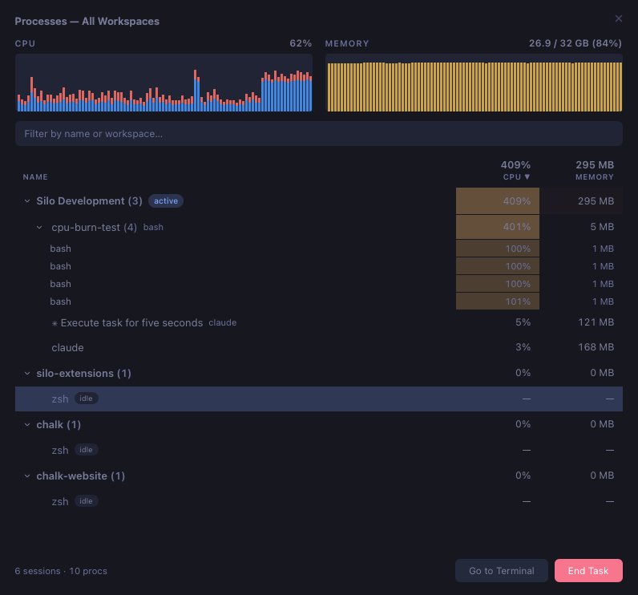

# System Monitor

A [Silo](https://github.com/silo-code/silo) extension that keeps CPU, memory, and per-terminal process activity visible at a glance — without leaving your editor. Works on **macOS, Linux, and Windows**.


## What you get

- **Side panel** — a dedicated SYSTEM tab with a memory donut chart, a scrolling CPU history graph (User vs System split), and a live Processes list for the current workspace
- **Status bar readouts** — compact live counters at the bottom of the window that stay visible even when the panel is closed; click any chip to open the all-workspaces modal
- **All-workspaces process monitor** — a Chrome/Windows Task Manager-style modal with live CPU and memory graphs, a filter box, sortable columns, and every terminal session across all workspaces (including soft-closed ones whose PTYs are still running) grouped by workspace (see below)
- **Configurable** — choose which metrics appear, on which surfaces, and in what order via Settings or the in-panel gear icon
- **Persistent settings** — your choices are saved across restarts and apply to all workspaces automatically

## Processes

The Processes section shows one row per terminal in the active workspace —
its foreground program, live CPU/memory (rolled up across its child processes,
so a busy build running under a shell doesn't read as idle), and idle/busy
state. Expand a row to see the full process tree; click a title to jump to
that terminal; hover a row for a one-click **kill** (with a confirmation) that
terminates the process group but leaves the shell itself running.

CPU/memory stats are opt-in and only sampled while the panel is visible and
the section is enabled — closing the panel or disabling it in Settings stops
the extra polling. Process trees (the expand/kill affordances) require `ps`
and aren't available on Windows; the panel still shows each terminal's
foreground program there.

## All-workspaces process monitor

When CPU is climbing and you're not sure which workspace (or whether any
workspace) is the cause, click **All processes…** at the bottom of the side
panel, or click any status bar chip, to open the process monitor.



- **Live mini graphs** — CPU (User + System split, same bar style as the panel) and memory history so you can see the trend at a glance
- **Filter** — type to narrow by task name or workspace name
- **Sortable columns** — click Name, CPU, or Memory to re-sort; groups reorder by their aggregate, sessions reorder within each group
- **Collapsible workspace groups** — sorted hottest-first; each group shows its aggregate CPU/memory with heat tinting that deepens toward your configured danger threshold. Soft-closed workspaces (and members of a closed group) still appear when they have live sessions — closing a workspace keeps its PTYs running until you hard-delete it.
- **Selection + actions** — click to select a row, then use **Go to Terminal** (activates the workspace and focuses the terminal) or **End Task** (kill with confirmation); double-clicking a row also jumps straight to the terminal. Use **Hide closed workspaces** in the footer to omit soft-closed workspaces; the choice is saved with your settings.

## Cross-platform

The extension is a reference implementation for writing platform-aware Silo
extensions. It asks the host which OS it's running on via `ctx.system.getInfo()`
and selects a matching **collector** (`src/collectors/`) — each one a small,
unit-tested module with a pure parser:

| Platform | CPU source | Memory source | Memory donut |
| --- | --- | --- | --- |
| **macOS** | `iostat -c` | `vm_stat` + `sysctl hw.memsize` | App / Wired / Cache / Free |
| **Linux** | `/proc/stat` (read via `ctx.files`, no subprocess) | `/proc/meminfo` | Used / Cache / Free |
| **Windows** | PowerShell `Get-Counter` | PowerShell `Get-CimInstance` | Used / Free |

The CPU User/System split is preserved on all three platforms. Memory categories
differ per OS, so the donut renders whatever segments the active collector
reports rather than a fixed list. Adding a platform means adding one collector
and a case in `selectCollector` — the union type from the SDK makes a missing
case a compile error.

### Permissions

Declared in `package.json` under `silo.permissions`:

- **`process`** — run `iostat` / `vm_stat` / PowerShell on macOS and Windows.
- **`fs:read`** — read `/proc/stat` and `/proc/meminfo` on Linux (these live
  outside the workspace). Reading `/proc` rather than shelling out also avoids
  subprocess-spawn restrictions under sandboxed Linux packaging.

## Installing

### From a GitHub Release

1. Go to [Releases](https://github.com/silo-code/silo-extensions/releases?q=system-monitor).
2. Right-click the `.tgz` asset → **Copy link address**.
3. In Silo: **Settings → Extensions**, paste the URL and click **Install**.

### From source

```sh
git clone https://github.com/silo-code/silo-extensions
cd silo-extensions/system-monitor
npm install
npm run build
```

Then in Silo: **Settings → Extensions → Install from folder**, point at this directory.

## Building

```sh
npm install
npm run build        # one-shot
npm run build:watch  # watch mode
npm test             # unit tests
```
